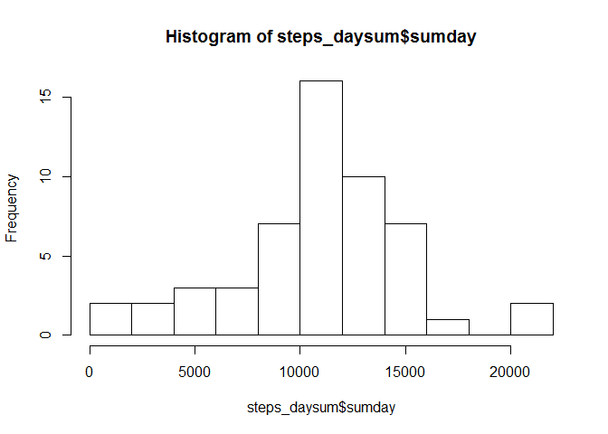

# Reproducible Research - Project 1

Data were obtained from https://d396qusza40orc.cloudfront.net/repdata/data/activity.zip on 10/01/2016, but assume data are in current working directory.


```r
unzip("activity.zip")
activity <- read.csv("activity.csv", header=TRUE)  
head(activity)
```

```
##   steps       date interval
## 1    NA 2012-10-01        0
## 2    NA 2012-10-01        5
## 3    NA 2012-10-01       10
## 4    NA 2012-10-01       15
## 5    NA 2012-10-01       20
## 6    NA 2012-10-01       25
```

Group and sum steps by days.  Compute and print mean and median.


```r
library(dplyr)
```

```r
steps_daysum <- summarise(group_by(activity, date), sumday=sum(steps))
step_day_median = median(steps_daysum$sumday, na.rm=TRUE)
step_day_mean = mean(steps_daysum$sumday, na.rm=TRUE)
cat("median: ", step_day_median, " , mean: ", step_day_mean, sep="")
```

```
## median: 10765 , mean: 10766.19
```

Plot histogram.


```r
hist(steps_daysum$sumday, breaks=10)
```

 

Create dataframe with interval indexed by it's order in the day (61 days total, 288 5 minute intervals per 24 hour period, code assumes data set has full 288 sequences per day)


```r
days = nrow(activity)
activity_indexed <- transform(activity, seq_no=rep(1:288, days)) %>% group_by(seq_no) %>% summarise(seq_mean=mean(steps, na.rm=TRUE))
```

Find max of mean of intervals across days and plot.


```r
dec_hours_of_max <- activity_indexed[max(activity_indexed$seq_mean), ]$seq_no * 5 / 60
cat("Hour and minute of average max steps: ", as.integer(dec_hours_of_max), ":",
            as.integer((dec_hours_of_max %% 1) * 60), sep="")
```

```
## Hour and minute of average max steps: 17:10
```

```r
par(col="blue")
plot(activity_indexed$seq_no, activity_indexed$seq_mean,
     type="o",
     xlab="Minute of Day / 5", ylab="Mean Steps in Interval",
     main="Mean Steps by Interval Number")
```

 

Investigate and impute missing data by replacing NA values with mean for that interval from other intervals contained in active_indexed df


```r
cat("Number of missing values:", sum(is.na(activity$steps)))
```

```
## Number of missing values: 2304
```

```r
get_index <- function(interval_num, numdays=61){
  # function that will compute an index (nth interval of the day) from the interval
  # in the raw data file to be used as a lookup in activity_indexed
  lookup_index <- interval_num %% 288
  if (lookup_index[1] == 0)
    lookup_index = 288
  lookup_index
}
activity_xformed <- transform(activity, steps_imputed=activity$steps) # start with raw values
for (i in 1:nrow(activity)){   # replace NAs with value looked up from activity_indexed
  if (is.na(activity_xformed[i, 4])){ 
    activity_xformed[i, 4] <- round(activity_indexed[get_index(i), 2])
  }
}

# Reporting
steps_imputed_daysum <- summarise(group_by(activity_xformed, date), sumday=sum(steps_imputed))
step_imputed_day_median = median(steps_imputed_daysum$sumday)
step_imputed_day_mean = mean(steps_imputed_daysum$sumday)
cat("median (imputed): ", step_imputed_day_median, " , mean (imputed): ", step_imputed_day_mean, sep="")
```

```
## median (imputed): 10762 , mean (imputed): 10765.64
```

```r
cat("Change in median from data with NA's to data with imputed values: ", step_imputed_day_median - step_day_median, "steps")
```

```
## Change in median from data with NA's to data with imputed values:  -3 steps
```

```r
cat("Change in mean from data with NA's to data with imputed values: ", step_imputed_day_mean - step_day_mean, "steps")
```

```
## Change in mean from data with NA's to data with imputed values:  -0.549335 steps
```

```r
hist(steps_imputed_daysum$sumday, breaks=10)
```

 

Find if step interval averages are greater for weekdays than weekends


```r
activity_xformed <- transform(activity_xformed, seq_no=rep(1:288, 61))
activity_xformed <- transform(activity_xformed, day_of_week=weekdays(as.Date(activity_xformed[, 2], "%Y-%m-%d"), TRUE))
activity_xformed <- transform(activity_xformed, weekend=ifelse(activity_xformed$day_of_week %in% c("Sat", "Sun"), "weekend", "weekday"))

xformed_grouped <- group_by(activity_xformed, weekend, seq_no)

sum_xformed_grouped <- summarise(xformed_grouped, mean_by_day_type=mean(steps_imputed))
library(lattice)
xyplot(mean_by_day_type ~ seq_no | weekend, data=sum_xformed_grouped, 
       layout=c(1,2,1), type="l", 
      xlab="Minute of day / 5", ylab="Mean Steps of 5 Minute Interval",
      main="Comparison of Average Steps by 5 Minute Interval\nBetween Weekends and Weekdays")
```

 


The weekend step activity appears to be greater than the weekday activity starting around 10 am although weekday activity seems greater in the earliest part of the waking day.
